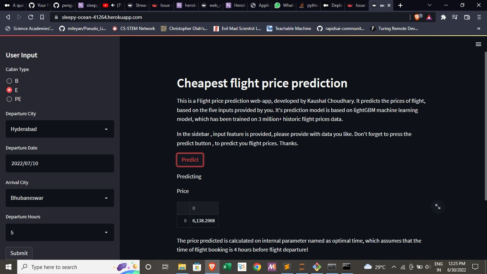

# Flight-price-prediction-app
https://img.shields.io/badge/Python-3776AB?style=for-the-badge&logo=python&logoColor=white https://img.shields.io/badge/GitHub-100000?style=for-the-badge&logo=github&logoColor=white https://img.shields.io/badge/Kaggle-20BEFF?style=for-the-badge&logo=Kaggle&logoColor=white https://img.shields.io/badge/Heroku-430098?style=for-the-badge&logo=heroku&logoColor=white https://img.shields.io/badge/sublime_text-%23575757.svg?&style=for-the-badge&logo=sublime-text&logoColor=important https://img.shields.io/badge/Maintained%3F-yes-green.svg

**Deployed Machine learning model(lightGBM) with an accuracy of over 87% for flight price prediction**.
It takes 5 inputs from the user 
1. `Cabin` (Cabin type)
2. `Dept_city` (Departure city / city where flight is to be taken)
3. `Dept_date` (the date of flight )
4. `arrival_city` (city where flight has to land)
5. `Dept_hours` (the approximate integer/ nearest integer to flight departure timing)

**The output of the model is float point value of flight Price upto 4 decimal places**.

**Note :** The internal model is based on a `optimal_time` parameter , which assumes that time of booking the flight is 4 hours before departure.
So, according to model, the cheapest flight prices are 4 hours before actual flight takeoff. 
Please book your flights accordingly.

# Dataset
The model has been trained with a dataset having *14 attributes* and over *3 million+ data points*.
The model took only five parameters , same as input parameters, for final training as according to 
feature importance map, only these *5 parameters* were found to useful .

# Model https://img.shields.io/badge/Colab-F9AB00?style=for-the-badge&logo=googlecolab&color=525252
The model *LightGBM* is decision **tree based regression model** , optimized with a gradient boosting method to enhance performance.
The model used adam_optimizer as learning parameter* and `learning_rate=0.01`.
It had *20,000 estimators*.
The *max_depth* parameter of decision tree was set to `max_depth=8`.
It had an evaluation_metric as `eval_metric=rmse`.

# Evaluation
We used mean_squared_error and mean_absolute_error for final evaluation of the model.

**Link to the website**

[Heroku-app](https://sleepy-ocean-41264.herokuapp.com/)

https://img.shields.io/website-up-down-green-red/http/monip.org.svg website:(https://sleepy-ocean-41264.herokuapp.com)

**Screenshot of the website**

*Thanks*

**This project was the final part of Data Analyst Internship at Technocolabs Softwares Inc. ** 

*Please, feel free to fork this repo and tinker with the code.*

*Don't forget to give a star to this repo, if you liked it* `:)`

